# β - VAE (from scratch using pytorch)
Implementation of a $\beta$-Variational Autoencoder ($\beta$-VAE) to learn disentangled latent representations of 2D shapes using the dSprites dataset, focusing on separating generative factors like scale, rotation, and position.

## Motivation
Variational Autoencoders (VAEs) excel at learning compact latent representations of data, but their standard formulation often entangles multiple generative factors (e.g., shape and color) within individual latent dimensions, hindering interpretability and downstream tasks. β-VAEs address this by introducing a hyperparameter β > 1 to scale the KL-divergence term in the loss function, which enforces a stronger prior on the latent space. This promotes disentanglement, where each latent dimension independently controls a single, semantically meaningful factor of variation—yielding more modular, intuitive representations that enhance generative control, transfer learning, and fairness in AI models. This from-scratch PyTorch implementation demystifies this mechanism

## Dataset

## Model Architecture

## Elbo Loss 

## Loss curve 

## Results

Result by changing latent Z from -3.0 to 3.0

| z0                                    | z1                                    | z2                                    | z3                                    | z4                                    | z5                                    | z6                                    | z7                                    | z8                                    | z9                                    |
| --------------------------------------|---------------------------------------|---------------------------------------|---------------------------------------|---------------------------------------|---------------------------------------|---------------------------------------|---------------------------------------|---------------------------------------|---------------------------------------|
|  | 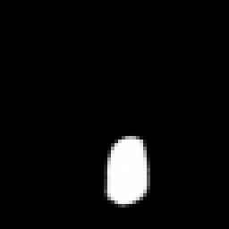 | 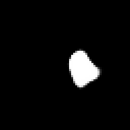 | 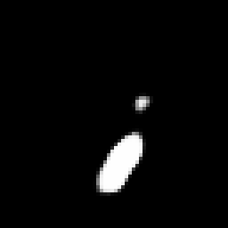 | 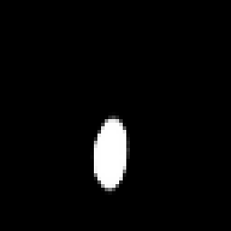 | 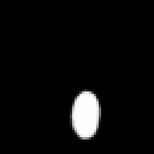 | 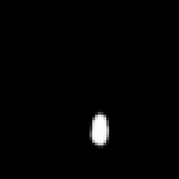 | 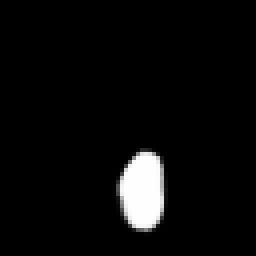 | 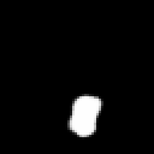 | 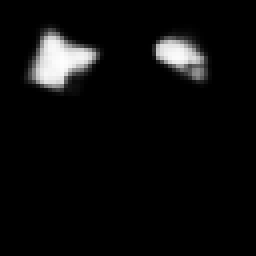 | 
|  | 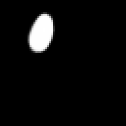 | 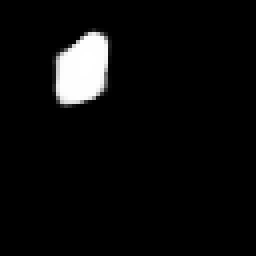 |  |  |  | 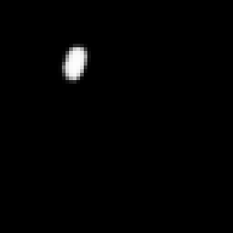 | 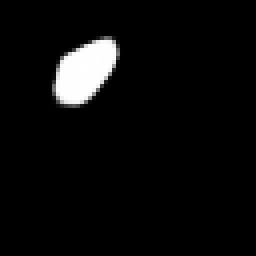 | 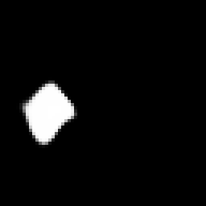 | 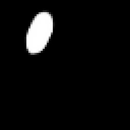 | 
| 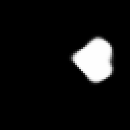 | 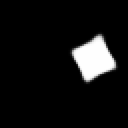 | 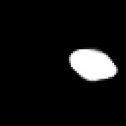 | 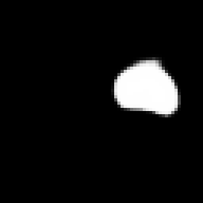 | 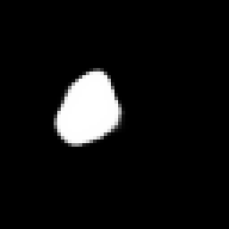 | 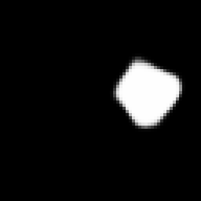 | 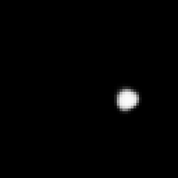 | 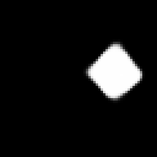 | 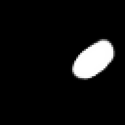 | 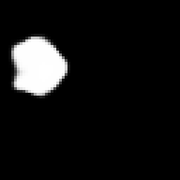 | 
|  | 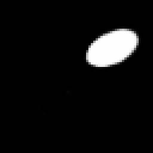 | 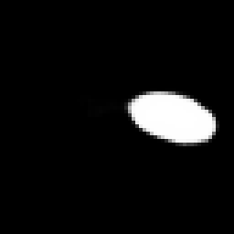 | 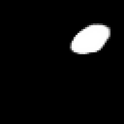 | 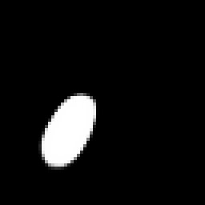 | 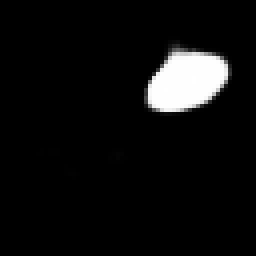 | 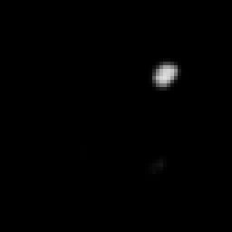 | 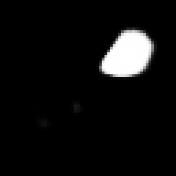 | 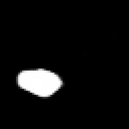 | 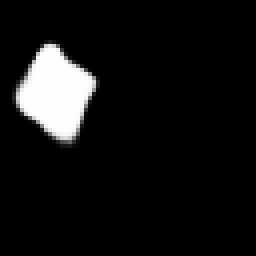 | 
